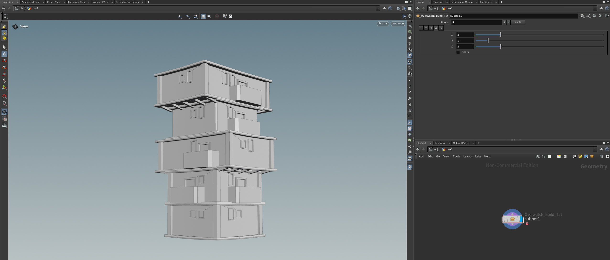
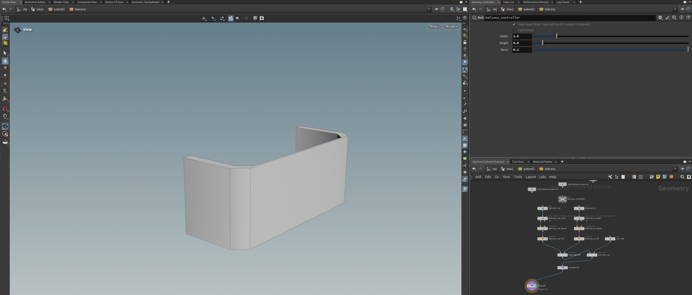
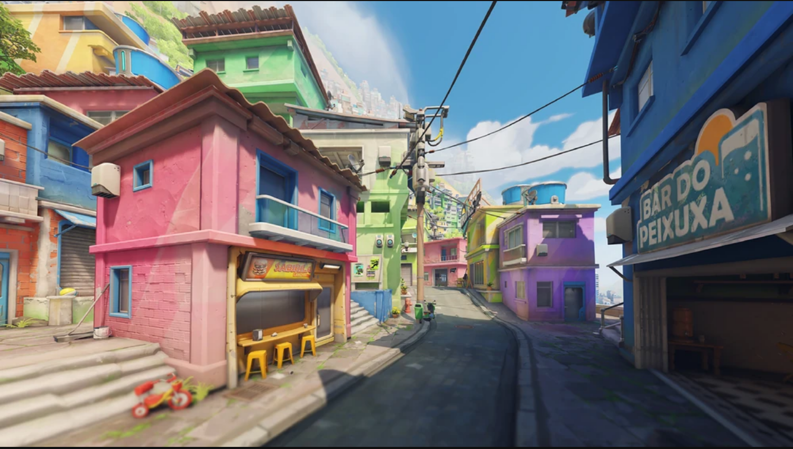

# CIS 5660 HW04 Procedural Buildings

## Project Overview
For this homework, I mainly just followed the Procedural House tutorial and create a procedural house that simulate the building in Paraiso. Here's the direct link to the simple video demo:

[Demo video](https://drive.google.com/file/d/1Jd9tsx5AMxxI3A7n3G436eHKkv6xopjp/view?usp=drive_link)

The tutorial is linked here: 
https://www.youtube.com/watch?v=uIe97023sDk&t=979s&ab_channel=SimonHoudini

## Project details

In general, the buildings can increase the number of floors and edit details of each floor, such as the `x y z` components, or width and height. There are also pillars and borders for each floor, with a checkbox to change between versions with and without pillars for each floor. Additionally, if an upper floor overhangs the one below it, supports are automatically generated.

More specifically, I also created windows, doors, and balconies that — although relatively simple — simulate those in Paraiso. They may be randomly generated differently based on the number and size of the floor. Inside the subnetworks that generate these components, controllers are placed at the top to adjust their parameters of the components.

I also demonstrated the control methods in the demo video, but the screenshot above shows the controller and the parameters it can modify. Within the controller, I added adjustable settings for width, height, and bevel distance for the corners.

---

## Sample building picked

Just go Paraiso! Or maybe try other overwatch buildings with more research in the future.

